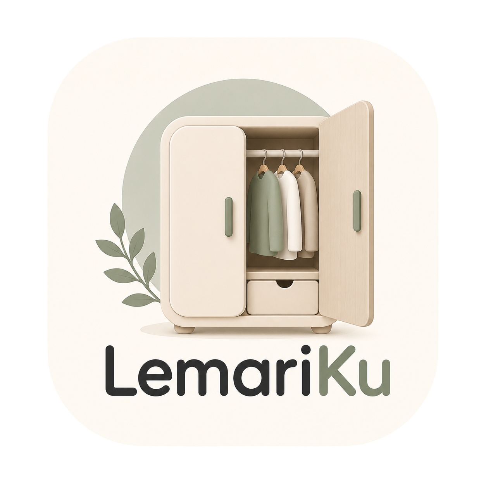

<div align="center">

# 🧺 LemariKu

### Wardrobe Inventory & Laundry Tracker

*Katalog isi lemarimu, lalu lacak setiap pakaian yang dikirim ke laundry — biar tidak ada lagi baju yang hilang.*



</div>

---

## 📖 Latar Belakang

Aplikasi ini lahir dari masalah nyata.

Sudah **3 kali** saya kehilangan pakaian saat menggunakan jasa laundry — beberapa di antaranya baju yang masih tergolong baru, bahkan celana. Kerugiannya nyata, dan yang bikin kesal: sulit membuktikan baju mana yang hilang karena tidak ada catatannya.

Solusi manual — mencatat satu per satu setiap mau mengirim laundry — ternyata **memakan waktu dan kurang akurat**. Saya sering lupa wujud visual baju yang mana, warnanya seperti apa, dan detailnya. Mengandalkan ingatan saja tidak cukup.

Dari sinilah **LemariKu** dibuat: sebuah aplikasi berbasis web (**mobile-first**) untuk **mengkatalog seluruh isi lemari sekali saja**, lalu cukup **tambah (+) item ke daftar laundry** setiap mau mengirim cucian. Tinggal isi nama jasa laundry dan estimasi selesai, lalu daftar bisa **diekspor jadi PDF atau dibagikan lewat tautan** sebagai bukti dan catatan yang bisa dicek ulang saat pengambilan.

---

## ✨ Fitur Utama

| | Fitur | Penjelasan |
|---|---|---|
| 👕 | **Katalog Lemari** | Daftarkan setiap pakaian sekali: nama, kategori (Kaos, Kemeja, Celana, Jaket), warna kain, dan **foto asli** (opsional). |
| 📸 | **Foto Visual** | Unggah foto pakaian — otomatis dikecilkan agar hemat ruang. Bantu mengingat wujud baju secara visual, bukan cuma teks. |
| 🏷️ | **Status Real-time** | Setiap pakaian punya status: **Di Lemari** atau **Sedang Cuci**. |
| ➕ | **Kirim Laundry** | Pilih beberapa pakaian dari lemari, isi nama jasa laundry & estimasi selesai, lalu proses jadi satu *batch*. |
| 📋 | **Pelacakan Batch** | Pantau semua batch laundry yang sedang berjalan, lengkap dengan daftar isi visual untuk **dicek saat pengambilan**. |
| 🧾 | **Catatan / PDF** | Buat tanda terima berisi daftar pakaian sebagai bukti. |
| 🔗 | **Bagikan Tautan** | Bagikan daftar laundry lewat tautan (WhatsApp, email, dll.) tanpa perlu aplikasi. |
| ✅ | **Tandai Selesai** | Saat baju diambil, tandai batch selesai — pakaian otomatis kembali ke status *Di Lemari*. |
| 💾 | **Tersimpan Otomatis** | Seluruh data (katalog, foto, batch) tersimpan di perangkat lewat `localStorage` — tetap ada walau halaman ditutup. |

---

## 🔄 Alur Penggunaan

```
1. Katalog       →  Daftarkan isi lemari (sekali saja): foto, nama, kategori, warna
2. Kirim Laundry →  Pilih baju yang mau dicuci  →  isi jasa laundry + estimasi selesai
3. Proses        →  Batch dibuat, baju berstatus "Sedang Cuci"
4. Status        →  Lacak batch  →  cetak PDF / bagikan tautan sebagai bukti
5. Ambil Cucian  →  Cocokkan daftar  →  Tandai Selesai  →  baju kembali ke lemari
```

---

## 🗂️ Tiga Layar Aplikasi

| Layar | Fungsi |
|-------|--------|
| **Lemariku** | Katalog seluruh pakaian dalam grid, dengan filter kategori dan tombol **+** untuk menambah item. |
| **Kirim** | Memilih pakaian yang tersedia di lemari dan mencatat detail pengiriman laundry. |
| **Status** | Daftar batch laundry yang berlangsung, isi batch, estimasi selesai, serta aksi PDF / Bagikan / Selesai. |

---

## 🛠️ Tech Stack

Dibangun sebagai **single-page app statis — tanpa build step, tanpa instalasi**:

- **React 18** (UMD via CDN)
- **Babel Standalone** — transpile JSX langsung di browser
- **Tailwind CSS** (CDN) dengan palet warna *Japandi* kustom
- **Lucide Icons** (UMD)
- **Google Fonts** — Poppins (UI) + Playfair Display (display)
- **localStorage** untuk penyimpanan data lokal
- Desain **mobile-first**, dibungkus dalam *frame* perangkat iOS

### 🎨 Palet Warna

| Token | Hex | Pemakaian |
|-------|-----|-----------|
| `bg` | `#FAF6F0` | Latar utama |
| `ink` | `#2C2A29` | Teks / aksen gelap |
| `sage` | `#6D8271` | Warna primer / aksi |
| `card` | `#F1EBE3` | Permukaan kartu |

---

## 🚀 Menjalankan Secara Lokal

Karena Babel memuat file `.jsx` lewat *fetch*, aplikasi perlu dijalankan lewat **server statis** (membuka `index.html` langsung via `file://` akan diblokir browser karena CORS).

**Opsi 1 — VS Code (paling mudah):** pasang ekstensi **Live Server**, lalu klik kanan `index.html` → *Open with Live Server*.

**Opsi 2 — Python:**
```bash
python -m http.server 8000
```
Lalu buka `http://localhost:8000`

**Opsi 3 — Node.js:**
```bash
npx serve
```

> 💡 Untuk pengalaman terbaik, aktifkan **mode tampilan perangkat (device toolbar)** di DevTools browser, karena aplikasi ini didesain *mobile-first*.

---

## 📁 Struktur Proyek

```
LemariKu/
├── index.html         # Entry point — memuat dependency CDN & semua script
├── ios-frame.jsx      # Komponen frame perangkat iOS
├── lk-data.jsx        # Palet, data awal, ikon, atom UI bersama, helper
├── lk-screens.jsx     # Tiga layar utama + modal (Add, Receipt/PDF, Share)
├── lk-app.jsx         # State root, navigasi, dan mounting aplikasi
├── LemariKu.png       # Pratinjau aplikasi
└── uploads/           # Aset
```

---

## ▲ Deploy ke Vercel

LemariKu adalah situs **statis murni**, jadi bisa dideploy ke [Vercel](https://vercel.com) **gratis (paket Hobby)** tanpa konfigurasi apa pun. Cara termudah, **tanpa perlu terminal**:

1. Buka **https://vercel.com** → **Sign Up / Login** → **Continue with GitHub**.
2. Di dashboard, klik **Add New… → Project**.
3. Pada repo **`aqilwahid/LemariKu`**, klik **Import** (kalau belum muncul, klik **Adjust GitHub App Permissions** lalu beri akses).
4. Di halaman konfigurasi, biarkan semua **default**:
   - **Framework Preset:** *Other* (terdeteksi otomatis)
   - **Build Command** & **Output Directory:** biarkan kosong — situs ini tidak perlu proses build.
5. Klik **Deploy**, tunggu ±30 detik.
6. Vercel memberi URL publik seperti `lemariku.vercel.app` — buka di HP. 🎉

Setiap kali kamu `git push` ke branch `Main`, Vercel otomatis deploy ulang. Domain kustom bisa diatur di **Settings → Domains**.

---

## 🗺️ Status & Roadmap

LemariKu saat ini adalah **prototipe fungsional** dengan data tersimpan secara lokal di browser. Beberapa hal yang direncanakan ke depan:

- [ ] Ekspor PDF asli yang dapat diunduh (saat ini masih berupa pratinjau catatan)
- [ ] Tautan berbagi yang benar-benar dapat dibuka (saat ini masih placeholder)
- [ ] Sinkronisasi antar-perangkat (akun & cloud)
- [ ] Riwayat laundry & statistik (frekuensi, jasa langganan)
- [ ] Notifikasi pengingat estimasi selesai

---

## 👤 Pembuat

Dibuat oleh **Ach. Nur Aqil Wahid** ([@aqilwahid](https://github.com/aqilwahid)) — berangkat dari masalah pribadi kehilangan pakaian di laundry. 🧺

---

<div align="center">
<sub>LemariKu — biar tiap helai bajumu selalu terlacak.</sub>
</div>
